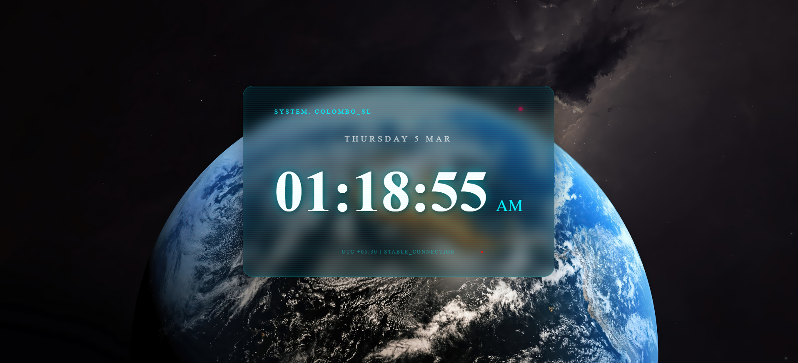

# 🌌 Colombo Station: Futuristic Digital Clock

A high-performance, **React-based** digital clock featuring a "Cyber-Glass" UI. This application acts as a mission-control-style HUD (Heads-Up Display) over a stunning 4K deep-space background, hard-coded to **Sri Lanka (Asia/Colombo)** time.

---

## 🚀 Features

- **Fixed Sri Lanka Time:** Uses the `Intl.DateTimeFormat` API to lock the time to **Asia/Colombo (UTC+5:30)**, ensuring accuracy regardless of the viewer's location.
- **Futuristic Glassmorphism:** Implements semi-transparent panels with `backdrop-filter` blurs and neon cyan accents.
- **Jitter-Free Display:** Uses monospaced typography and `tabular-nums` to prevent the layout from shifting as seconds increment.
- **Animated HUD:** Includes a pulsing "Live" status indicator and a scrolling "scanline" effect for a high-tech feel.
- **Performance Optimized:** Efficient React `useEffect` hooks with proper interval cleanup to prevent memory leaks.

---

## 🛠️ Technical Stack

| Tech                  | Usage                                                   |
| :-------------------- | :------------------------------------------------------ |
| **React**             | Component-based UI logic and state management.          |
| **JavaScript (ES6+)** | Date manipulation and `Intl` API for timezone handling. |
| **CSS3**              | Glassmorphism, CSS Animations, and Backdrop-filters.    |

---

## 📂 Project Structure

```text
src/
├── App.js              # Main application entry
├── DigitalClock.jsx    # Core logic & Sri Lanka time calculations
├── DigitalClock.css    # Futuristic styling & animations
└── assets/             # 4K Space background wallpaper
```

---

## ⚙️ Installation & Setup

1. Clone the repository

```bash
git clone [https://github.com/DulanDhanush/digital-clock-react-.git](https://github.com/DulanDhanush/digital-clock-react-.git)
```

2. Navigate to the directory

```bash
cd digital-clock-react-
```

3. Install dependencies

```bash
npm install
```

4. Start the development server

```bash
npm start
```

---

## 🎨 Design Philosophy

The UI is designed to look like a Transparent HUD (Heads-Up Display).

- Visibility: A 12px blur allows the space background to remain visible while ensuring the clock text is readable.

- Glow: Layered text-shadow simulates light emission from the numbers against the dark background.

- Stability: Monospaced fonts ensure every character takes up the same width, providing a professional, stable readout.

## Preview


